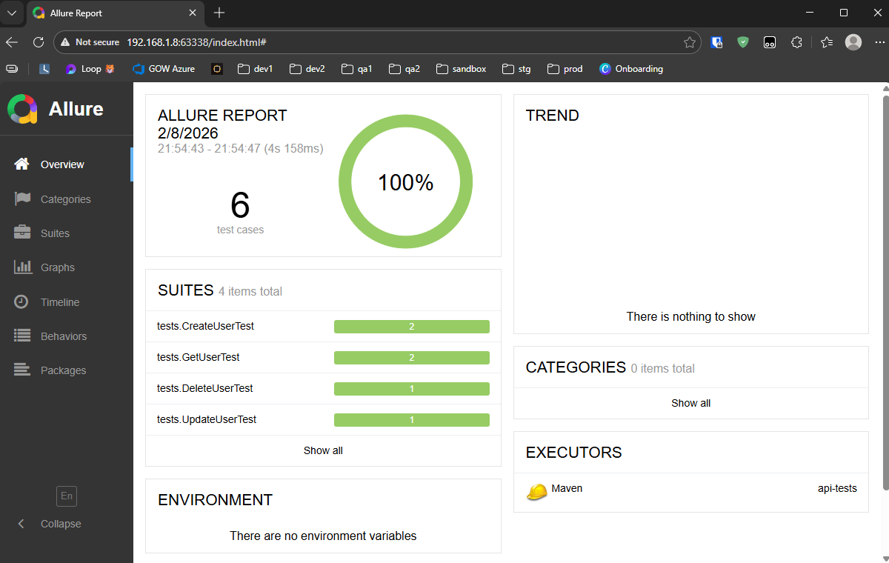
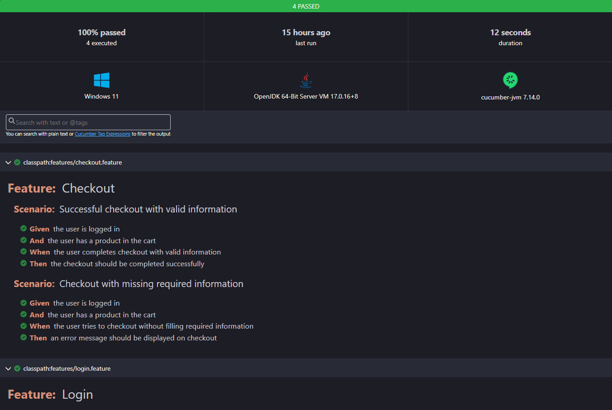

# QA Automation Challenge

## Overview

This project contains two automation modules:

- api-tests → API automation using RestAssured
- e2e-tests → UI automation using Selenium + Cucumber

The project was refactored to remove hardcoded values, centralize configuration and improve maintainability.

## API tests

Application used: https://jsonplaceholder.typicode.com

JSONPlaceholder is a public fake API used for testing and prototyping.

### Important limitation:
When accessing non-existent resources, the API returns 404 with an empty body {}. It does not return structured error messages.

### Execution:
```
cd api-tests

mvn clean test

mvn clean test -Denv=dev (with environment)
```

Available environments: 
- dev (default) 
- qa 
- prod

### Report:
After running, use the following command to see the interactive dashboard:
```
mvn allure:serve
```



## UI tests (E2E)

Application used: https://www.saucedemo.com

SauceDemo is a demo e-commerce application designed for UI automation practice. Was selected for its stability and realistic user flows, including login, cart, and checkout.

### Execution:

```
cd e2e-tests
mvn clean test
mvn clean test -DchromeHeadless=true (headless)
mvn clean test -Denv=dev (with environment)
```

Available environments: 
- dev (default) 
- qa 
- prod

### Report:
Open the file generated at target/cucumber-report.html



## Scenarios Covered
- API: Multiple endpoints validation including status codes, headers, and body (positive & negative).
- UI: Login and complete e-commerce checkout flow.

## API Stack:
- Java: 17
- JUnit: 5.11.0
- RestAssured: 5.4.0
- Jackson Databind: 2.17.0
- Allure JUnit5: 2.24.0
- AspectJ Weaver: 1.9.20.1
- Maven Surefire Plugin: 3.3.0
- Allure Maven Plugin: 2.12.0
## E2E Stack:
- Java: 17
- JUnit Jupiter: 5.11.0
- Cucumber: 7.14.0
- Selenium: 4.17.0
- WebDriverManager: 5.6.3
- JUnit Platform Suite: 1.10.1
- Maven Surefire Plugin: 3.3.0

## CI/CD Pipeline
- Automated execution via GitHub Actions on every push.
- All reports are saved as artifacts in the Actions summary.

## Future Improvements
- Mobile: The structure is ready for an Appium module, that would be integrated as a parallel job in the existing CI pipeline. In a production scenario, the mobile suite would be triggered automatically after successful API/E2E runs (or in parallel), ensuring that the application remains stable across all platforms at every commit.

### Improvements Implemented After Feedback
The project was updated to address the technical review feedback:

- Removed hardcoded URLs in both API and E2E modules.
- Centralized environment configuration.
- Centralized RestAssured setup in a base client class.
- Replaced Map payloads with typed POJOs.
- Improved test structure and responsibility separation.
- Added support for multiple environments.
- Added headless execution support for UI tests.
- Removed generic assertions and made validations scenario-specific.

## About ErrorResponse

An ErrorResponse model was introduced to support structured error validation. However, JSONPlaceholder does not provide structured error bodies for negative scenarios.

For example, a 404 response returns an empty JSON object {}.
Because of this API limitation, negative validations are intentionally based on HTTP status codes and response structure, instead of error message fields.